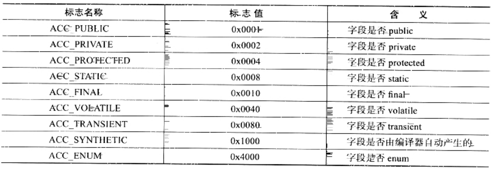

# 深入理解 Java虚拟机 第二版 @ 周志明 201306

> 读书笔记

## 简介

全书围绕，五大部分, 内存管理、执行子系统、程序编译优化、高效并发等核心主题, 讲解了 JVM结构原理, 介绍了JAVA技术体系, 发展历程等。

重点讲解的 JVM 的自动内存管理, 虚拟机的内存区域结构, 并介绍的常见的 垃圾收集算法及垃圾收集器。并讲解了 虚拟机的监控工具。

虚拟机的执行子系统, 类文件接口, 类加载机制, 虚拟机字节码执行引擎

> 纲要
>
> 1. JAVA虚拟机发展史
>
>   - JAVA技术体系
>   - JAVA发展史
>   - JVM发展史
>
> 2. 自动内存管理
>
>   - JVM 内存模型
>   - 垃圾收集算法
>   - 垃圾收集器
>
> 3. 虚拟机执行子系统
>
>   - 类文件结构
>   - 类加载机制 (类加载过程: 加载, 验证, 准备, 解析, 初始化)
>   - 类加载器
>
> 4. 程序指令执行
>
>   - 字节码指令
>   - 字节码执行引擎

> - 虚拟机性能监控与故障处理
> - 虚拟机性能调优


## 正文摘要

Java的技术体系主要由支撑 Java程序运行的虚拟机、提供各开发领域接口支持的 Java API、Java编程语言 及 许多第三方Java框架等构成。

JAVA虚拟机层面隐藏了底层技术的复杂性以及其与操作系统的差异性, 其在千差万别的物理机上建立了统一的运行平台, 使得Java应用的开发比传统C/C++应用的开发更高效便捷

- Q: 目前JAVA主要开发集中在, 业务层面的开发上, 其比C/C++更高效便捷, 是因为其虚拟机屏蔽了硬件层面的差异？而在游戏等高效率开发领域, 因为屏蔽了硬件差异而不能高效发挥其效率, 而在底层开发中, JAVA反而不作为主流开发语言？
- Q: 总结各语言的优势和缺点, 并概括出其解决的主要领域问题
- Q: 业务领域由那些 ？电力、金融、通信

JAVA虚拟机, 为了达到给所有硬件提供一致的虚拟平台的目的, 牺牲了一些与硬件相关的性能特性


### JAVA虚拟机发展史

> JAVA SE 版本历史

```
JDK Beta  - 1995
JDK 1.0   - 1996年1月
JDK 1.1   - 1997年2月
J2SE 1.2  - 1998年12月
J2SE 1.3  - 2000年5月
J2SE 1.4  - 2002年2月
J2SE 5.0  - 2004年9月
Java SE 6 - 2006年12月
Java SE 7 - 2011年7月
Java SE 8 (LTS)       - 2014年3月
Java SE 9             - 2017年9月
Java SE 10 (18.3)     - 2018年3月
Java SE 11 (18.9 LTS) - 2018年9月
Java SE 12 (19.3)     - 2019年3月
```

> OpenJDK 版本历史

```
OpenJDK 6   - 基于JDK 7，但经过修改后提供了Java 6的开源版本
OpenJDK 7   - 2011年7月28日
OpenJDK 7u  - 该项目开发Java Development Kit 7的更新
OpenJDK 8   - 2014年3月18日
OpenJDK 8u  - 该项目开发Java Development Kit 8的更新
OpenJDK 9   - 2017年9月21日
JDK项目于2018年3月10日至20日发布
JDK项目于2018年9月11日至25日发布
OpenJDK 12  - 稳定阶段
```

> 虚拟机

- Sun Classic VM

  诞生于java1.0（1996年），是世界上第一款商用Java虚拟机，其是一款解释型的java字节码执行引擎，在jdk1.4（2002年）后被完全淘汰

- HotSpot

  1994年4月27日, HotSpot 作为JDK1.2的附加程序发布, 并作为后续SunJDK的默认虚拟机

- JRockit

>

JAVA不仅仅是一门编程语言, 还是一个由一系列计算机软件和规范形成的技术体系, 这个体系提供了完整的用于软件开发和跨平台部署的支持环境。

Java程序设计语言, JAVA虚拟机, JAVA API类库三部分统称为JDK(Java Development Kit), JDK 是用于支持Java程序开发的最小环境。


模块化是解决应用系统与技术平台越来越复杂、越来越庞大问题的一个重要途径，模块化是建立各种功能的标准件的前提。

通过特定领域的语言去解决特定领域的问题是当前软件开发应对日趋复杂的项目需求的一个方向。


### OpenJDK

> [参考](openjdk.md#简介)


### 自动内存管理

#### 1. JVM内存模型, 运行时内存数据区域

内存动态分配与垃圾收集技术, 虚拟机的自动内存管理机制, 解决内存泄漏和内存溢出问题

JAVA虚拟机在执行Java程序的过程中会把它所管理的内存划分若干不同的数据区, 这些区域由各自的用途以及创建和销毁时间。


- 1. 方法区 (Method Area)
- 2. 虚拟机栈 (VM Stack)
- 3. 本地方法栈 (Native Method Stack)
- 4. 堆 (Heap)
- 5. 程序计数器 (Program Counter Register)

- 6. 运行时常量池
- 7. 直接内存区域

- 执行引擎
- 本地库接口 - 本地方法库

> 1. 程序计数器 (Program Counter Register)

程序计数器, 是一小块较小的内存空间, 可以看作是当前线程所执行的字节码的行号指示器, 字节码解释器工作时就是通过改变这个计数器的值来选取下一条需要执行的字节码指令, 分支、循环、跳转、异常处理、线程恢复等基础功能都依赖于其完成

该区域是线程私有的，该内存区域是唯一一个在Java虚拟机规范中没有规定任何OutOfMemoryError情况的区域

Java虚拟机的多线程是通线程轮流切换并分配处理器执行时间的方式来实现的, 在任意时刻一个处理器都只会执行一个线程中的指令, 其每个线程都需要独立的程序计数器

如果线程正在执行的是一个Java方法, 计数器记录的是正在执行的虚拟机字节码指令地址, 如果执行的是Native方法, 则改计数器值为空

> 2. 虚拟机栈 (VM Stack)

虚拟机栈, 描述的是Java方法执行的内存模型, 每个方法在执行的同时会创建一个栈帧, 用于存储 局部变量表、操作数栈、动态链接、方法出口等信息。方法从调用到结束过程, 就是一个栈帧在虚拟机栈中入栈到出栈的过程

JAVA 虚拟机栈 (VM Stack) 也是线程私有的，其生命周期与线程相同

局部变量表存放了编译期可知的各种剧本数据类型 (boolean、byte、char、short、int、float、long、double)，对象引用(reference, 指向对象起始地址指针或指向一个代表对象的句柄或其他对象相关的位置) 和 returnAddress 类型 (指向一条字节码指令的地址)

局部变量表所需的内存空间在编译期间完成分配, 方法运行期间不会改变局部变量表的大小。

JAVA虚拟机规范, 对词区域规定了两种异常: 1. 线程请求的栈深度大于虚拟机所允许的深度, 抛出StackOverflowError异常 2. 扩展时无法申请到足够内存, 抛出 OutOfMemoryError 异常

> 3. 本地方法栈

虚拟机栈为虚拟机执行Java方法服务, 本地方法栈则为虚拟机使用的Native方法服务。

Java虚拟机规范中, 没有对本地方法栈中方法使用的语言, 方式及数据结构做强制规定。

> 4. 堆

Java堆是被所有线程共享的一块内存区域, 在虚拟机启动时创建。此内存区域的唯一目的时存放对象实例, 几乎所有的对象实例都在此区域分配内存。

Java虚拟机规范中描述, 所有的对象实例以及数组都要在堆上分配, 但是随着JIT编译器的发展与逃逸分析技术逐渐成熟, 栈上分配、标量替换优化技术将会发生一些微妙的变化。Java堆可以物理上不连续内存区域, 只要逻辑上连续即可。

Java堆是垃圾收集器管理的主要区域

垃圾收集器, 基本采用分代收集算法, 主要划分区域为: 新生代和老年代, 细分为 Eden空间, Form Survivor空间, To Survivor空间

分配缓冲区(Thread Local Allocation BUffer, TLAB)

> 5. 方法区

也是线程共享的内存区域, 用于存储已被虚拟机加载的类信息、常量、静态变量、即时编译器编译后的代码等数据

该区域内存回收的目的, 主要针对常量池的回收和堆类型的卸载

> 6. 运行时常量池

运行时常量池, 是方法区的一部分, Class文件中除了又类的版本、字段、方法、接口等描述信息外, 还有常量池信息, 用于存放编译器生成的各种字面量和符号引用。

> 7. 直接内存

直接内存, 并不是虚拟机运行时数据区的一部分, 也不是Java虚拟机规范中定义的内存区域。

在JDK1.4引入的NIO, 引入了基于通道(Channel)和缓冲区(Buffer)的I/O方式, 可以直接使用Native函数库直接分配堆外内存, 然后通过Java堆中存储的DirectByteBuffer对象作为这快内存的引用操作。


#### 2. HotSpot 虚拟机对象, 虚拟机内存中数据细节

- 数据如何创建, 布局, 访问：Java堆中对象的分配、布局、访问

- 1. 对象的创建
- 2. 对象的内存布局
- 3. 对象的访问定位

> 1. 对象创建

new指令, 检查指令参数在常量池中定位类的符号引用, 检查符号引用代表的类是否被加载, 解析和初始化。否则执行类的加载过程

类加载检查后, 将为新生对象分配内存, 对象所需内存内存大小由加载类确定, 将从Java堆中划分出来

指针碰撞 (Bump the Pointer), 空闲列表 (Free List)

解决频繁分配对象内存并发问题, 一种是对分配内存空间的动作进行同步处理, 二种是把内存分配的动作按照线程划分在不同的空间中进行 (本地线程分配缓冲 (Thread Local Allocation Buffer, TLAB))

内存分配完成后, 虚拟机将分配的内存空间都初始化零值, 这个操作保证对象实例字段可以不赋初始值就可以直接使用

虚拟机对对象进行相关设置, 设置对象是那个类的实例, 如何查找类的元数据信息, 对象哈希码, 对象GC分代年龄等信息。这些信息存放在对象的对象头(Object Header)

虚拟机根据字节码中, 是否跟随invokespecial指令, 决定是否执行 init 方法, 进行初始化赋值

> 2. 对象的内存布局

存储布局包括, 对象头 (Header)、实例数据 (Instance Data) 和 对齐填充 (Padding)

对象头包含两部分信息, 一种是存储对象自身的运行时数据, 例如哈希值(HashCode)、GC分代年龄、锁状态标志、线程持有的锁
、偏向线程ID、偏向时间戳等; 另一部分时类型指针, 即对象指向它的类元数据的指针

当对象是一个数组时, 对象头中还必须有一块用于记录数组长度的数据, 虚拟机可以通过普通对象的元数据信息确定对象的大小, 但是数组的元数据中无法确定数组的大小

实例数据部分是对象真正存储的有效信息, 也是程序代码中所定义的各种类型的字段内容, 这部分的存储顺序受到虚拟机的分配策略参数和字段在源码中定义顺寻的影响

> 3. 对象的访问定位

其是通过栈上的reference数据来操作堆上的具体对象, 虚拟机规范中只规定了reference类型是一个指向对象的引用, 没有定义这个引用应该通过何种方式定位、访问堆中的对象的具体位置。目前主流的访问方式有使用句柄和直接指针两种。

使用句柄, 会在堆中划分出一块内存作为句柄池, feference中存储的就是对象的句柄地址, 而句柄中包含了对象实例数据与类型数据各自的具体地址信息


使用直接指针访问, 此时堆中对象的布局就必须考虑如何放置访问类型数据的相关信息, 此时reference中存储的就是对象地址


#### 3. 垃圾收集算法及垃圾收集器

- 1. 对象存活判定算法
- 2. 垃圾收集算法
- 3. 垃圾收集器

> 1. 对象存活判定算法

垃圾收集 (Garbage Collection, GC), GC的历史比Java久远, 早在1960年诞生于MIT的Lisp是第一门真正使用内存动态分配和垃圾收集技术的语言。主要解决问题, 那些内存需要回收？ 什么时候回收？ 如何回收？

引用计数算法(Refernece Counting), 用来判断对象是否存活, 其给对象中添加一个引用计数器, 每当一个地方引用时加一, 引用失效减一, 当计数器为0时对象可能再被使用。其实现简单, 判断效率高, 但是其很难解决对象之间互相循环引用的问题。

可达性分析算法 (Reachability Analysis), 用来判断对象是否存活, 其基本思想就是通过一些列的 "GC Roots" 对象作为起始点, 从这些节点开始向下搜索, 搜索所走过的路径称为引用链 (Refernece Chain), 当一个对象在 GC Roots 没有任何引用链相连时, 则证明此对象不可用

作为GC Roots对象包含几种: 1. 虚拟机栈(栈帧本地变量表)中引用的对象 2. 方法区中类静态属性引用的对象 3. 方法区中常量引用对象 4. 本地方法栈中JNT(Native方法)引用的对象

引用, 如果reference类型的数据中存储的数值代表的时另一块内存的其实地址, 称之为这块内存代码着一个引用。当内存还足够时, 则能保留在内存中, 当内存空间进行垃圾收集后还非常紧张时, 则可以抛弃这些对象, 很多缓存功能符合此场景。

引用, 强引用 (Strong Reference)、软引用 (Soft Reference)、弱引用 (Weak Reference)、虚引用 (Phantom Reference)

可达性分析, 对执行时间的敏感还体现在GC停顿上, 因为该项分析工作必须在一个能确保一致性的快照中进行, 指的是整个分析期间整个执行系统中对象引用关系不能变化, 否则将无法满足准确性, 其导致GC进行时必须停顿所有Java执行线程 (stop-the-world)

> 2. 垃圾收集算法

- 标记-清除算法  (Mark-Sweep)
- 复制收集算法
- 标记-整理算法
- 分代收集算法

最基础的收集算法，是标记-清除算法, 其分为两个阶段, 首先标记出所有需要回收的对象, 在标记完成后统一回收所有标记的对象。
但是其有两个主要不足, 一个是效率问题, 标记和清除两个过程的效率都不高; 另一个是空间问题, 标记清除之后会产生大量不连续的内存碎片。

复制算法, 为了解决标记-清除算法效率问题, 其将可用内存按容量划分为大小相等的两块, 每次只使用其中一块, 当其中一块用完了, 将还存活的对象复制到另一块上面, 然后再把已经使用过的内存空间一次清理掉。其实现简单, 运行高效。但是内存空间使用效率不高。

现在虚拟机, 基本采用复制算法, 来回收新生代。经研究, 新生代对象绝大部分都是短暂存活的, 并不需要按照1:1来划分内存空间, 而是将内存划分为一块较大的 Eden空间和两块较小的Survivor空间, 每次使用Eden和其中一块Survivor空间。当回收时, 将Eden和Survivor中还存活的对象, 一次性复制到另一块Survivor空间上, 最后清理掉Eden和刚才使用过的Survior空间。

HotSpot 虚拟机, 默认 Eden和Survivor的比例为 8:1, 当Survivor空间不够用时, 依赖其他内存(老年代)进行分担保存。

标记-整理算法, 为了解决复制收集算法再对象存活率较高时就要进行较多复制操作而导致的效率变低问题, 以及内存中大部分对象存活情况下。针对老年代, 使用 标记-整理算法 , 其和标记-清除算法一样, 但是后续不是直接针对可回收对象进行清理, 而是让所有存活对象都向一端移动, 然后直接清理掉端边界以外的内存。

分代收集算法 (Generational Collection), 该算法只是根据对象存活周期的不同, 将内存划分为几块。一般是把Java堆划分为新生代和老年代, 这样就可以根据各年代的特点采用适当的收集算法。 

> 3. 垃圾收集器

- Serial 收集器, 串行垃圾收集器
- ParNew 收集器, 并行垃圾收集器
- Parallel Scavenge 收集器
- Serial Old 收集器
- Parallel Old 收集器

- CMS (Concurrent Mark Sweep) 收集器
- G1 (Garbage First) 收集器

- RTSJ

Serial 收集器, 串行垃圾收集器, 其是最基本的历史最悠久的收集器, 其是单线程的收集器, 在进行垃圾收集时, 必须暂停其他所有工作线程, 直到收集结束。其特点是简单而且高效。

ParNew 收集器, 并行垃圾收集器, 其是 Serial 收集器 的多线程版本, 其特点是, 有个与性能无关的特点就是, 除了Serial收集器外只有其可以与CMS收集器配合工作。

Parallel Scavenge 收集器，是一个新生代收集器, 其也是使用复制收集算法的收集器, 并行收集器, 其目标是达到一个可控的吞吐量, 而与CMS等收集器关注尽可能缩短垃圾收集是用户线程的停顿时间不同。自适应调节策略是Parallel Scavenge与ParNew的一个重要区别。

Serial Old 收集器, 是Serial收集器的老年代版本, 同样是单线程收集器, 使用标记-整理算法, 其主要意义是给在Client模型下的下虚拟机使用。

Parallel Old 收集器，是Parallel Scavenge 收集器的老年代版本, 使用多线程和标记-整理算法, 在注重吞吐量以及CPU资源敏感的场合, 可以优先考虑ParallelScavenge和ParallelOld收集器

CMS收集器, 是一种以获取最短回收停顿时间为目标的收集器, 采用标记-清除算法, 分为四个步骤: 1. 初始标记 2. 并发标记 3. 重新标记 4. 并发清除。初始标记与重新标记, 需要stop-the-world, 重新标记是为了修改并发标记期间因用户程序继续运作而导致标记产生变动的那一部分标记记录。其有三个明显缺点：1. 对CPU资源非常敏感, 因占用部分CPU资源而导致程序变慢, 吞吐量降低 2. 无法处理浮动垃圾 3. 基于标记-清除算法, 而产生大量空间碎片

G1收集器, 是一款面向服务端应用的垃圾收集器, 其特点 1. 并发并行 2. 分代收集 3. 空间整合, 其基于两次复制收集算法, 类似标记-整理算法 4. 可预测停顿

G1收集器的堆内存布局和其他收集器有很大差别, 其将整个堆划分成多个大小相等的独立区域, 虽然依旧保留新生代和老年代, 但不在是物理隔离, 它们都是一部分Region的集合。其通过 Remembered Set操作, 来记录区域对象之间的引用关系, 来避免全堆扫描。

G1收集器主要运作阶段 : 1. 初始标记 2. 并发标记 3. 最终标记 4. 筛选回收


### 虚拟机执行子系统

- 1. 类文件结构
- 2. 类加载机制 (类加载过程: 加载, 验证, 准备, 解析, 初始化)
- 3. 类加载器


二进制本地机器码(Native Code)

硬件体系、机器指令集、操作系统

字节码 (ByteCode), 程序存储格式

#### 1. Class类文件结构

Class文件是一组以8位字节为基础单位的二进制流, 各数据项目严格按照顺寻紧凑的排列在Class文件中, 当遇到需要占用8位字节以上空间的数据项时, 则会按照高位在前的方式分割成若干个8位字节进行存储

根据Java虚拟机规范规定, Class文件格式采用一种类似于C语言结构体的伪结构体来存储数据, 这种伪结构体只有两种数据类型：无符号数和表

无符号数属于基本数据类型, 以u1、u2、u4、u8来分别代表1个字节、2个字节、4个字节、8个字节的无符号数。无符号数可以用来描述数字, 索引引用、数量值或者按照UTF-8编码构成的字符串值

表是由多个无符号数或者其他表作为数据项构成的符合数据类型, 表用于描述由层次关系的符合结构的数据, 整个Class文件本质上就是一张表


``` Class文件格式
类型            名称                  数量                      描述
u4              magic                1                         魔数
u2              minor_version        1                         次版本号
u2              major_version        1                         主版本号
u2              constant_pool_count  1
cp_info         constant_pool        constant_pool_count-1     常量池
u2              access_flags         1                         访问标志
u2              this_class           1                         类索引
u2              super_class          1                         父索引
u2              interfaces_count     1
u2              interfaces           interfaces_count          接口索引
u2              fields_count         1
filed_info      fields               fields_count              字段表
u2              methods_count        1
method_info     methods              methods_count             方法表
u2              attributes_count     1
attribute_info  attributes           attributes_count          属性表集合
```

magic (Magic Number), 魔数, 4字节, 其作用是确定这个文件是否为一个能被虚拟机接受的Class文件, 固定值为 0xCAFEBABE

minor_version, Class文件的版本号, 次版本号

major_version, Class文件的版本号, 主版本号

constant_pool, 常量池, Class文件中的资源仓库, 其与其他项目关联最多的数据结构, constant_pool_count 计数器从 1 开始计数, 常量池主要存储两大类常量, 字面量和符号引用, 符号引用属于编译原理方面概念, 包括三类常量：1. 类和接口的全限定名 2. 字段的名称和描述符 3. 方法的名称和描述符。常量池中的每一项常量都是一个表, 


Java代码在进行Javac编译时, 不想C/C++那样由链接步骤, 而是在虚拟机加载Class文件时候进行动态链接。所以Class文件中不会保存各方法、字段的最终内存布局信息。因此这些字段、方法的符号引用不经过运行期转换的话无法得到真正的内存入口地址。

access_flags, 访问标志, 用于识别一些类或接口层次的访问信息, 包括这个Class是类还是接口, 是否定义为public类型, 是否定义为abstract类型, 是否声明为final


类索引(this_class)和父索引(super_class), 接口索引(interfaces), Class文件中由这三项来确定这个类的继承关系。

类索引用来确定类的全限定名, 父索引用来确定类的父类全限定名, 接口索引用来描述类实现了那些接口


fields, 字段表 用于描述接口或类中声明的变量。字段包含类级变量和实例级变量, 但是不包含在方法类声明的局部变量。




描述符得作用是用来描述字段得数据类型、方法得参数列表(数量、类型、顺序)和返回值


methods, 方法表 用于描述接口或类中声明的方法, 方法得代码经编译器编译成字节码指针后存放在方法属性表集合中为Code得属性里面


attributes, 属性表集合, 在Class文件字段表、方法表中可以携带自己得属性表集合, 用来描述某些场景专有得信息


#### 2. 类加载机制 (类加载过程: 加载, 验证, 准备, 解析, 初始化)

以动态的, 运行时的角度了解字节码流在虚拟机执行引擎中是如何被解释执行的

代码编译的结果从本地机器码转变为字节码, 是存储格式发展的一小步, 却是编程语言发展的一大步

- 1. 类加载时机
- 2. 类加载过程
  - 加载
  - 验证
  - 准备
  - 解析
  - 初始化
- 3. 类加载器
  - 常用类加载器
  - 双亲委派模型

类加载机制，就是虚拟机将描述类的数据从Class文件中加载到内存。并对数据进行校验、转化、解析和初始化的过程。最终形成虚拟机可以使用的Java类型。

Java语言的类加载，类型的加载、连接和初始化过程都是在程序运行期间完成的，与编译时就进行连接的语言不同，其在加载时会消耗些性能开销，但是为程序提供了高度的灵活性，其动态扩展的语言特性就是依赖于运行期动态加载和动态连接的特点实现的。


> 1. 类加载时机

类声明周期，就是类被加载到虚拟机开始，直到卸载出内存为止的整个过程，其包括七个阶段：加载(Loading)、验证(Verification)、准备(Preparaion)、解析(Resolution)、初始化(Initialization)、使用(Using)、卸载(Unloading)

其中，验证、准备、解析，三个部分统称为连接(Linking)


> 2. 类加载过程

- 1. 加载(Loading)
- 2. 验证(Verification)
- 3. 准备(Preparaion)
- 4. 解析(Resolution)
- 5. 初始化(Initialization)
- 6. 使用(Using)
- 7. 卸载(Unloading)

1. 加载(Loading)

加载阶段需要完成，1. 通过一个类的全限定名来获取此类的二进制字节流 2. 将这个字节流所代表的静态存储结构转化为方法区的运行时数据结构 3. 在内存中生成一个代码这个类的 java.lang.Class对象，作为方法区这个类的各种数据的访问入口

2. 验证(Verification)

验证时连接阶段的第一步，其目的时为了确保Class文件的字节流中包含的信息符合当前虚拟机的要求

验证阶段，主要包括四个阶段的检验动作：文件格式验证、元数据验证、字节码验证、符号引用验证

3. 准备(Preparaion)

准备阶段，是正式为类变量分配内存并设置类变量初始值得阶段，这些变量(类变量，实例变量随着对象在堆中处理)所使用得内存都将在方法区中进行分配。

4. 解析(Resolution)

解析阶段，是将虚拟机常量池内的符号引用替换为直接引用得过程。

符号引用，以一组符号来描述所引用的目标，符号可以是任何形式的字面量，只要使用时能无歧义地定位到目标即可

直接引用，时可以直接指向目标的指针、相对偏移量或是一个能间接定位到目标的句柄

解析动作主要针对类或接口、字段、类方法、接口方法、方法类型、方法句柄、调用点限定符 七类引用进行

5. 初始化(Initialization)

初始化阶段是类加载过程的最后异步, 类加载除了加载阶段用户程序可以勇敢自定义类加载参与外，其余都由虚拟机主导和控制

初始化阶段是执行类构造器 <clinit>() 方法的过程, 其是由编译器自动收集类中，所有类变量的赋值动作和静态语句块(static{})中的语句合并产生的。其收集的顺序由语句再源文件中出现的顺序所决定的，静态语句块只能访问到定义再静态语句块之前的变量, 定义再它之后的变量，在前面的静态语句块可以赋值但是不能访问

类构造器 <clinit>() 方法执行时，虚拟机会保证在 子类 类构造器 <clinit>() 之前，父类的类构造器 <clinit>()已经执行完成，也就是说父类中定义的静态语句块要优先于子类的变量赋值操作


#### 3. 类加载器

对于任何一个类，都需要由加载它的类加载器和这个类本身一同确立其在虚拟机中的唯一性，每一个类加载器，都拥有一个独立的类名称空间

其相等，包括代表类的Class对象的equals()方法、isAssignableFrom()方法、isInstance()方法的返回结果，也包括使用instanceof关键字做对象所属关系判定等情况

对于Java虚拟机来说，只存在两种不同的类加载器，一种时启动类加载(BootstrapClassLoader)，其时C++实现的是虚拟机的一部分; 另一种是由Java语言实现的独立于虚拟机外部的类加载器，其全部都继承于java.lang.ClassLoader。

- 1. 启动类加载 (Bootstrap ClassLoader)
- 2. 扩展内加载器 (Extension ClassLoader)
- 3. 应用程序类加载器 (Application ClassLoader)
- 4. 类加载器的双亲委派模型
- 5. 双亲委派模型的打破

> 1. 启动类加载器

这个类加载器负责将 存放在 JAVA_HOME\lib 目录中的，或备 -Xbootclasspath 参数所指定的路径中，并且是虚拟机识别的类库，加载到虚拟机内存中

> 2. 扩展内加载器

负责加载 JAVA_HOME\lib\ext, 或者备 java.ext.dirs 系统变量所指定的路径中的所有类库, 可以直接使用扩展类加载器

sun.misc.Launcher$ExtClassLoader 实现

> 3. 应用程序类加载器

这个类加载器是ClassLoader中的 getSystemClassLoader()方法的返回值, 也称之为系统类加载器。器负载加载用户路径 (ClassPath)上所指定的类库, 可以直接使用这个类加载器, 其是程序默认的类加载器

sun.misc.Launcher$AppClassLoader 实现

> 4. 类加载器的双亲委派模型


双亲委派模型, 要求除了顶层的启动类加载器外, 其余类加载器都有必须有自己的父类加载器。类加载器之间的父子关系一般都以组合关系来复用父加载器，而不是继承关系来实现。

双亲委派模型的工作过程是，当一个类加载器收到类加载请求，首先不会自己尝试加载这个类，而是将请求委派给父类加载器完成，所有请求将最终传递到顶层的启动类加载器中，只有当父类加载器返回无法完成加载请求(其搜索范围中没有找到所需的类)时，子加载器才会尝试自己加载。

双亲委派模型不是一个强制的约束模型，而是Java设计者推荐的类加载器实现方式

> 5. 双亲委派模型的打破

双亲委派模型，其很好的解决了各个类加载器的基础类的统一问题。但是像JNDI，需要对资源进行集中管理和查找，需要调用厂商实现并部署的应用程序的 ClassPath 的JNDI接口提供者 (SPI, Service Provide Interface) 的代码，其引入了 线程上下文类加载器 (Thread Context ClassLoader), 其可以通过 java.lang.Thread 类的 setContextClassLoaser() 方法进行设置，JNDI服务使用这个线程上下文类加载器取加载所需要的SPI代码，也就是父类加载器请求子类加载器去完成类加载器动作

对程序动态性的要求，例如代码热替换(HotSwap)、模块热部署(Hot Deployment)等。OSGi实现模块化热部署的关键就是它自定义的类加载器机制实现的，OSGi环境下，类加载器不再时双亲委派模型中的树状结构，而是进一步发展为更为复杂的网状结构


### 程序指令的执行

- 1. 字节码指令
- 2. 字节码执行引擎


