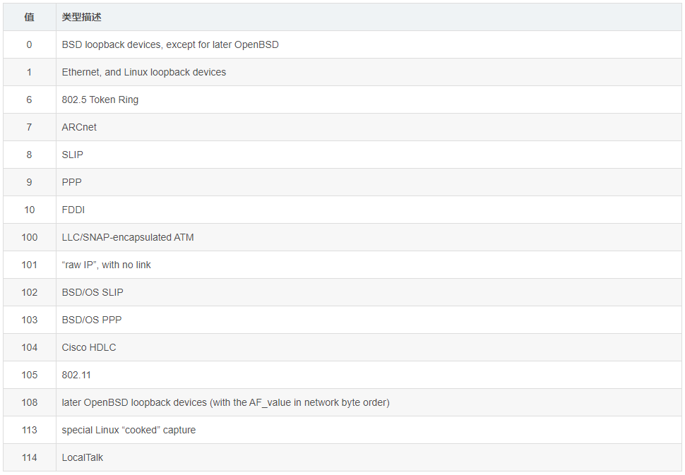

# PCAP

> pcap文件是常用的数据报存储格式，可以理解为就是一种文件格式，只不过里面的数据是按照特定格式存储的，所以我们想要解析里面的数据，也必须按照一定的格式。

## 简介

.pcap/.cap文件结构


1. Pcap Header

文件头，每一个pcap文件只有一个文件头，总共占24（B）字节，以下是总共7个字段的含义。

(24B -> 定位 17)

D4 C3 B2 A1   02 00   04 00   00 00 00 00   00 00 00 00   00 00 04 00   01 00 00 00

D4 C3 B2 A1 -> 4B , 0xD4C3B2A1 小端模式
02 00       -> 2B , 0x0200 主要版本号
04 00       -> 2B , 0x0400 次要版本号
00 00 00 00 -> 4B , 当地标准时间
00 00 00 00 -> 4B , 当地标准时间
00 00 04 00 -> 4B, 0x00040000=262144 最大的存储长度
01 00 00 00 -> 4B, 0x000001 链路类型, 1 以太网

> Magic(4B)

标记文件开始，并用来识别文件和字节顺序。

值可以为0xA1B2C3D4(大端模式, 按照原来的顺序一个字节一个字节的读) 或者 0xD4C3B2A1 (小端模式, 下面的字节都要交换顺序。现在的电脑大部分是小端模式)

> Major(2B)

当前文件的主要版本号，一般为0x0200

> Minor(2B)

当前文件的次要版本号，一般为0x0400

> ThisZone(4B)

当地的标准时间，如果用的是GMT则全零，一般全零

> SigFigs(4B)

时间戳的精度，一般为全零

> SnapLen(4B)

最大的存储长度，设置所抓获的数据包的最大长度，如果所有数据包都要抓获，将值设置为65535

> LinkType(4B)

链路类型。解析数据包首先要判断它的LinkType，所以这个值很重要。一般的值为1，即以太网




2. Packet Header

数据包头可以有多个，每个数据包头后面都跟着真正的数据包。以下是Packet Header的4个字段含义

(12B -> 定位 18 - 27)

18 24 79 60   CB 11 01 00   42 00 00 00  42 00 00 00

18 24 79 60  -> 4B, 0x60792418=1618551832 时间戳高位
CB 11 01 00  -> 4B, 0x000111CB=70091      时间戳低位
42 00 00 00  -> 4B, 0x00000042=66         抓取数据长度
42 00 00 00  -> 4B, 0x00000042=66         实际抓取数据长度


> Timestamp(4B)

  时间戳高位，精确到seconds，这是Unix时间戳。捕获数据包的时间一般是根据这个值

> Timestamp(4B)

时间戳低位，能够精确到microseconds

> Caplen(4B)

当前数据区的长度，即抓取到的数据帧长度，由此可以得到下一个数据帧的位置。

> Len(4B)

离线数据长度，网路中实际数据帧的长度，一般不大于Caplen，多数情况下和Caplen值一样


3. Packet Data

Packet 是链路层的数据帧，长度就是Packet Header中定义的Caplen值，所以每个Packet Header后面都跟着Caplen长度的Packet Data

也就是说pcap文件并没有规定捕获的数据帧之间有什么间隔字符串。Packet数据帧部分的格式就是标准的网络协议格式了。

> 以太网帧

```
00 E0 4C 36 03 41 02 42 0A 0B 01 B1 08 00 45 00
00 34 92 9B 40 00 40 06 90 90 0A 0B 01 B0 0A 0B
01 D3 23 2A 0F 36 59 8A CF 34 74 9E 4B 31 50 18
00 ED 73 96 00 00 00 00 00 0C 00 00 00 04 00 00
08 A6
```

## 案例


PcapHeader
Magic(4B)： D4 C3 B2 A1 表示小端模式，后面的字节从后往前读；
Major(2B)： 02 00，计算机读的是00 02；
Minor(2B)： 04 00，计算机读的是00 04；
ThisZone(4B)： 00 00 00 00，全零；
SigFigs(4B)： 00 00 00 00，全零；
SnapLen(4B)： FF FF 00 00, 计算机读的是：00 00 FF FF，所以是2^16-1=65535
LinkType(4B)： 01 00 00 00, 计算机读的是：00 00 00 01，表示是以太网类型

Packet Header
Timestamp(4B)： CA 4D A4 5C，计算机读的是：5C A4 4D CA，十进制：1554271690，日期为：2019-04-03 14:08:10；
Timestamp(4B)： 4F 2A 08 00，计算机读的是：00 08 2A 4F，十进制：535119，代表535119ms；
Caplen(4B)： BA 1C 00 00, 计算机读的是：00 00 1C BA，十进制：7354，代表后面的7354个字节为一个数据帧，之后又是一个新的PacketHeader，如此循环；
Len(4B)： BA 1C 00 00，和Caplen相同

