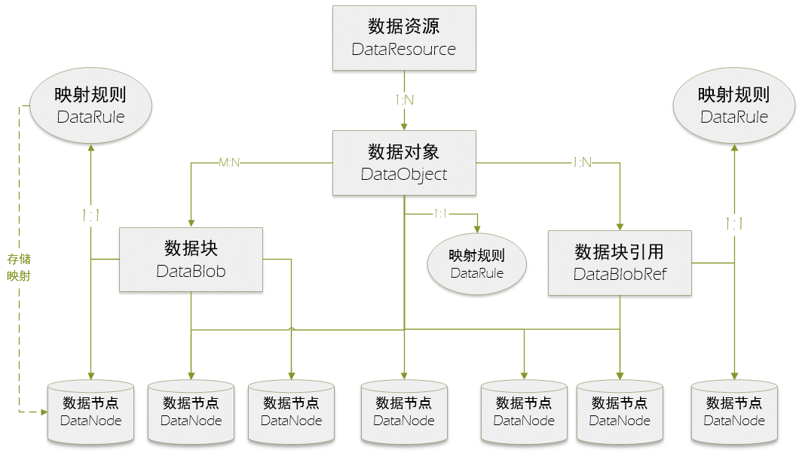
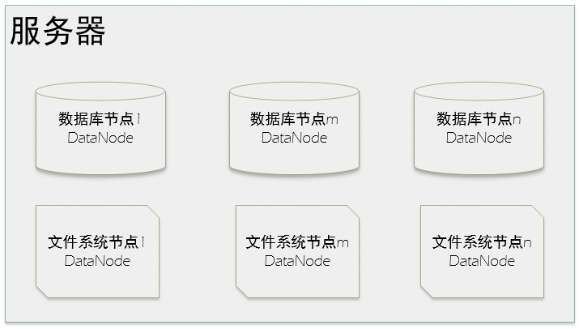
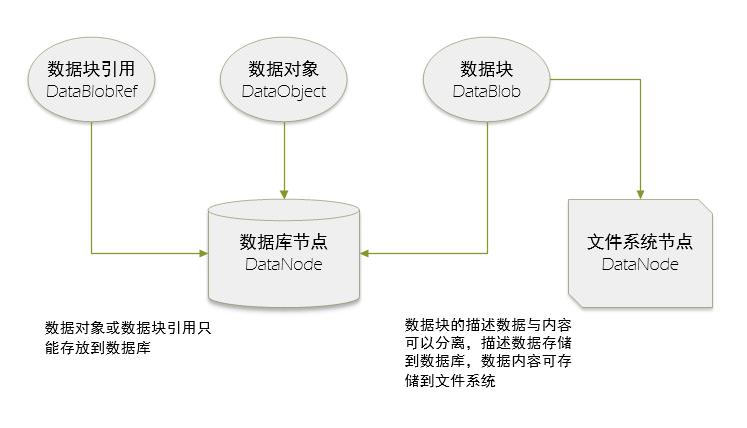
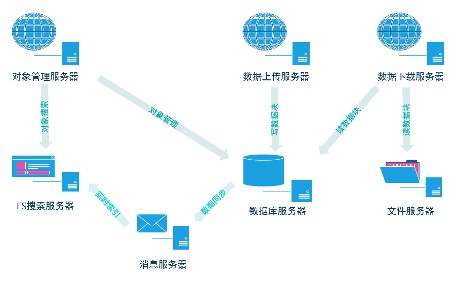
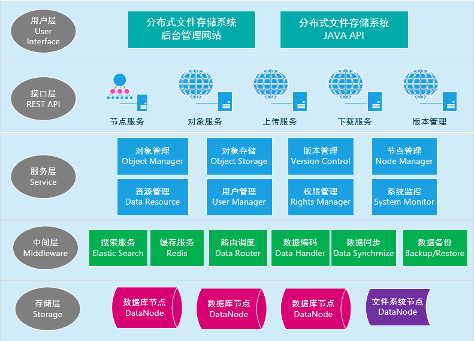
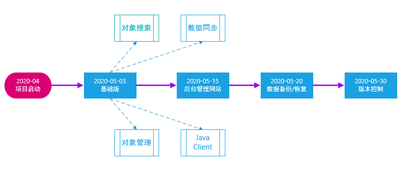

# 用JAVA从零开始写一个分布式文件存储系统

> distributed-file-storage-system

## 资源

> [官网](https://www.jianshu.com/p/7807eb8e7d7b)
>
> 

## 用JAVA从零开始写一个分布式文件存储系统

2011年做过一个人物挖掘搜索的系统，当时用C#写过一个爬虫框架，当时对150多个学术网站采集了约3亿网页文件，零散的文件一开始分散放置在不同的主机和移动硬盘上，后来管理与使用越来越难，索性自己基于MySQL + Solr写了一个分布式文件存储系统。

2020年疫情期间赋闲在家无事可干，多年技术管理已经让我忘记很多编程基础，正好用这个练手JAVA编程，用当下流行的Springboot + MyBatis + Redis + ElasticSearch + MySql + Vue + ElementUI 重新实现一个分布式文件存储系统的前后端，项目暂且命名BlobGenius。

### 一、设计思想与概念

数据存储：支持数据库或文件系统两种方式。数据库采用MySQL或PostgreSQL等开源数据库，表独立存储(每个表一个存储目录，每个表最大可存储64TB)，InnoDB等支持事物的存储引擎；文件系统采用最原始的文件块机制。

数据切块：支持对大文件对象或小数据对象分块存储，大文件采用256KB、512KB、1024KB或2048KB四种分块尺寸，小数据对象采用256B、1KB、2KB与4KB四种分块尺寸，数据块默认采用SHA-256哈希算法计算数据校验码。

数据引用：一个数据对象DataObject由多个数据块DataBlob组成，一个数据块也可以是多个数据对象的组成部分，两者是M：N关系，采用引用计数实现。

数据主键：数据块DataBlob主键由SHA-256哈希算法结合短码算法生成，由12个字符组成（可表达62^12个对象），基本可保证不同数据的哈希碰撞问题，同时，解决相同数据重复存储问题。

数据处理：数据块支持编码、加密与压缩技术，保障数据安全与存储效率，加密默认采用AES对称加密引擎，压缩采用GZIP算法。

数据备份：支持主从(master-slave)复制或对等复制两种机制，默认采用对等复制。

数据要素：数据三要素，数据对象-DataObject、数据块-DataBlob、数据引用-DataBlobRef。DataObject表达数据描述信息，包含对象名称、路径、大小、拥有者、校验码、创建/访问时间等信息。

数据节点：DataNode负责存储DataObject、DataBlobIds或DataBlob，块数据可以采用数据库或文件系统存储，描述信息统一存储在MySQL数据库。每个节点DataNode与一个MySQL实例对应，一个物理主机可配置多个MySQL实例。

数据资源：DataResource资源对象表示一种逻辑资源，如图片、视频等，每种资源都有自己的数据三要素，一个数据要素由多个数据节点DataNode负责数据存储。

数据路由：数据三要素DataObject、DataBlob、DataBlobRef都有主键，系统根据配置的路由规则将不同主键的记录分发到不同的数据节点与数据表，实现分服务器与分表存储机制。

对象搜索：采用ElasticSearch支持DataObject的实时索引与全文搜索，解决分服务器与分表后的统一搜索问题，实现存储服务与搜索服务分离。

版本管理：版本管理采用GIT机制，采用master、brunch与tag支持分支与版本管理，不同分支采用不同目录存储，同一个文件的多次提交保存历史数据。

### 二、系统架构

#### 2.1 数据逻辑

数据架构包括数据资源-DataResource、映射规则-DataRule，数据三要素数据对象-DataObject、数据块-DataBlob、数据引用-DataBlobRef，数据节点-DataNode负责数据存储。关系结构图如下：

**架构分析**

- 数据资源-DataResource。存储一组数据需要定义一种数据资源，系统可以定义若干种数据资源。

- 数据对象-DataObject。一种数据资源可以存储若干个数据对象，数据对象可以存放到1个或若干个数据节点-DataNode，分服务器或分表的路由规则由映射规则-DataRule对象定义。

- 数据块-DataBlob。数据对象被切分为若干个数据块存储，数据块主键根据数据内容的SHA-256哈希算法与短码算法生成。

- 数据块引用-DataBlobRef。定义数据对象-DataObject与数据块-DataBlob的引用关系。

- 数据节点-DataNode。一个数据节点对应一个MySQL实例，一个物理主机可以部署多个MySQL实例。

- 映射规则-DataRule。映射规则根据对象主键映射存储的节点与数据表，数据三要素均可独立定义自己的映射规则。

#### 2.2 存储结构

物理服务器与数据节点是一对多关系，数据节点支持数据库与文件系统两种方式，描述数据统一存储到数据库，块数据内容可存储到数据库或文件系统。

##### 2.2.1 服务器

服务器可以是物理主机或虚拟主机，一个主机可以部署多个数据节点，节点类型分为数据库节点与文件系统节点。逻辑关系如下图：

> 注意：一个服务器可以多少数据节点，需要有CPU、内存、存储容量、网络流量等资源多种综合因素决定，具体根据实际情况定义。

##### 2.2.2 存储设计

数据三要素DataObject、DataBlob或DataBlobRef的描述数据统一存储到数据库，块数据可以选择数据库存储或文件存储两种方式。逻辑关系如下图：

**存储分析**

- 数据对象。描述一个文件或自定义对象，记录只能存储到数据库节点。

- 数据块引用。一个数据对象引用多个数据块，记录存储到数据库节点。

- 数据块。包括描述数据与数据二进制内容，两者可以统一存储，数据内容也可以分离存储到文件系统。

#### 2.3 服务部署

服务节点包括接口服务与存储服务。接口服务支撑REST API访问，实现系统集成与二次开发，提供对象管理、数据上传与下载服务。存储服务提供数据库节点与文件系统节点访问服务，数据库节点通过MyBatis访问，文件系统节点通过TCP连接访问。部署示意图如下：

##### 2.3.1 对象管理

对象管理服务提供数据对象-DataObject的增删改查CRUD服务，以及对象搜索服务，同时，数据对象引用若干数据块，服务提供数据块引用DataBlobRef对象的增删改查服务，提供REST API接口服务。

##### 2.3.2 上传服务

数据上传服务支持Multipart/form-data格式的文件或数据块两种数据上传方式。注意：完整文件的上传受到系统限制。数据块上传最大块大小为2MB，多个数据块构成一个完整的数据对象，块数据上传方式数据对象大小没有限制，支持上传超大文件，支持断点续传。

##### 2.3.3 下载服务

数据下载服务支持application/octet-stream格式的文件或数据块两种数据下载方式，两种方式均支持断点续传。

##### 2.3.4 搜索服务

对象搜索服务采用ElasticSearch实现对象实时索引与搜索服务，辅助实现对象管理。

##### 2.3.5 消息服务

消息服务采用Redis的发布-订阅功能，数据服务器存储数据对象时，发布消息通知索引服务提交ES索引。

##### 2.3.6 文件服务

文件服务采用TCP Server，实现内网数据块快速传输，提供文件系统数据块存取与管理服务，支持文件块的CRUD操作。

##### 2.3.7 数据库服务

部署MySQL数据库节点，存储DataObject、DataBlob或DataBlobRef数据，根据映射规则-DataRule实现分服务器与分表路由规则。

#### 2.4 系统设计

系统设计包括用户层、接口层、服务层、中间层与存储层。整体设计如下图：

##### 2.4.1 用户层

用户层包括分布式文件数据存储系统后台管理网站与JAVA Client API.

##### 2.4.2 接口层

接口层提供节点服务、对象服务、上传服务、下载服务与版本控制服务。

- 节点服务。提供节点注册、性能监控、心跳监测、服务调度功能。

- 对象服务。提供数据对象创建、搜索、删除与修改功能。

- 上传服务。提供文件与数据块上传功能，支持超大文件上传与断点续传。

- 下载服务。提供文件与数据块下载功能，支持客户端数据块错误报告与检查功能，支持大文件下载与断点续传。

- 版本控制。提供项目创建、分支、删除、提交、锁定与解锁、迁出等功能。

##### 2.4.3 服务层

服务层包括对象管理、对象存储、版本管理、节点管理、资源管理、用户管理、权限管理与系统监控等模块。

##### 2.4.4 中间层

中间层包括搜索服务、缓存服务、路由服务、数据编码、数据同步与数据备份等服务。

- 搜索服务。集成Elastic Search，提供分散在各服务器与数据表中的数据对象的统一搜索服务。

- 缓存服务。集成Redis，提供用户对象、机构对象、数据资源、系统配置等常用信息缓存，利用发布-订阅功能实现数

- 据实施索引，实现分布式锁支持版本控制的访问冲突问题解决。

- 路由服务。根据数据映射规则，将不同数据资源、记录类型与对象主键分发到不同数据节点，存储到不同数据表或文件目录。

- 数据编码。数据存取时，提供数据编码、加密、压缩等数据处理功能，有效保障数据安全性与节省存储空间。

- 数据同步。利用线程池-ThreadPool实现数据对象-DataObject、数据块-DataBlob、块引用-DataBlobRef在不同数据节点同步。

- 数据备份。支持数据库-数据库，数据库-文件系统的备份-backup与恢复-Restore。

##### 2.4.5 存储层

数据存储支持数据库节点与文件系统节点，数据库访问使用MyBatis接口，文件系统采用自实现TCP链接访问。

### 三、发布计划

